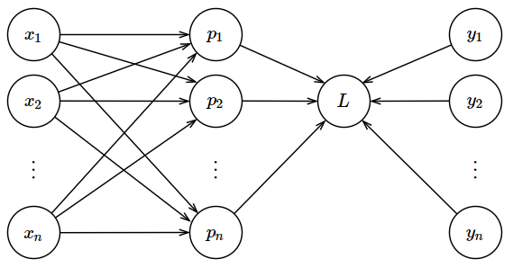
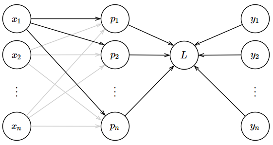

In this post I will atempt to explain the derivative of the cross entropy loss function, the input of which is activated using the softmax function. This post is intended to give me as well as the reader a better understanding of derivatives. Please point out any mathematical errors or any ambiguity in this post. If you have any question please feel free to ask.

# Introduction

One popular activation function that is often used for neural network is the softmax function. This function is usually used at the output layer, because it could squash a vector of numbers into a number between 0 and 1, and if those numbers are summed up the result is 1, in other words

$$
\begin{gather}
\mathbf{x} = \{ x_1, x_2, ..., x_n \} \\
\mathbf{p} = \text{softmax}(\mathbf{x}) = \{ p_1, p_2, ..., p_n \} \\
p_i  \in [0, 1] \\
\sum_i p_i = 1.
\end{gather}
$$

Why is it a nice property? Because we can think of each $  p_i  $ as a probability. Remember that in a neural network we often want to predict a class given the input. If we have a list of classes $ \mathbf{i} = \{ 1, 2, ..., n \} $, we can think of the $  p_i  $ as telling us what class to predict. If, let's say, the variable $  p_2=0.8  $, we can say that the model assigns a 80% probability that the input belongs to the class $ 2 $.

As an illustration, please refer to the graph below.

<!---->

The definition of the softmax function is

$$
\begin{equation}
\text{softmax}(\mathbf{x}) =
  \frac{\text{exp}(\mathbf{x})}
  {\sum_j \text{exp}(x_j)}.
\end{equation}
\label{eq:softmax}
$$

Next, we will examine the cross entropy loss function. First, keep in mind that the variable $  \mathbf{y}  $ is a one-hot encoded vector, where $  y_i=1  $ if the actual class is $  i  $, and 0 otherwise. The loss function is

$$
\begin{equation}
L(\mathbf{p}) = - \log p_i
  \text{ where }
  y_i = 1.
\end{equation}
\label{eq:loss}
$$

Note that the $ \log $ here is the same as natural logarithm, which is the logarithm with base $ e $, which some people refer to using the $ \ln $ notation.

To understand why Equation \eqref{eq:loss} make sense, let's walk through a simple example. Suppose that $ y_2 = 1 $. In other words, the input belong to class 2.  Now, to calculate the loss we only need to look at $ p_2 $.  If $ p_2 $ is equal to a number close to 1, say 90%, then our model is working correctly, since it gives a high probability that the input belongs to the class 2.  If we check with the formula, with $ p_2 = 90\% $, then the loss would be equal to $ -\log(0.9) \approx 0.10$. Let's check what would happen if our model assign a small probability, say $ p_2 = 10\% $. In this case, the loss would be equal to $ -\log(0.1) \approx 2.3$. As you can see, now the number is much higher than before, which means that the loss function penalizes the output $p_2$ for giving a low probability.

We can also define the loss function as

$$
\begin{equation}
L(\mathbf{p}) = - \sum_i y_i \log p_i.
\end{equation}
\label{eq:loss_sum}
$$

Why can we do that? Because we know that only one $ y_i $ is equal to one, and the rest is zero, and so we know that $ y_i \log p_i $ is equal to zero when $ y_i $ is zero.

But, why do we want to do this? The purpose is to make it easier to analyze the derivative. You see, with the loss function defined on Equation \eqref{eq:loss_sum}, it is now free from "conditional" such as "where ..." that was used on Equation \eqref{eq:loss}.

# Finding the Derivative

## What We Are Going to Do

What we are going to do in this post is, given the loss function $ L(\mathbf{p})  ​$ defined using the cross entropy function on Equation \eqref{eq:loss} and \eqref{eq:loss_sum}, where $ \mathbf{p} = \text{softmax}(\mathbf{x})  ​$, then we are going to try to understand the derivative of the loss function with respect to (w.r.t.) the vector $\mathbf{x}​$, or

$$
\begin{equation}
\frac{\partial L}{\partial \mathbf{x}}.
\end{equation}
$$

For the sake of brevity, I am going to regard $L(\mathbf{p})$ and $ L $ as the same thing.

## Breaking Down the Problem

As you may have noticed, our goal is to find the derivative of a *scalar* $L$ w.r.t. a *vector* $\mathbf{x}$. The result will be a vector defined as

$$
\begin{align}
\frac{\partial L}{\partial \mathbf{x}} &=
\left(
\begin{matrix}
\partial L / \partial x_1 \\
\partial L / \partial x_2 \\
\vdots \\
\partial L / \partial x_n
\end{matrix}
\right).
\label{eq:scalar-to-vector}
\end{align}
$$
On Equation \eqref{eq:scalar-to-vector} we can see that the derivative of $L$ w.r.t. to $\mathbf{x}$ is a vector of length $n$ and the $i$th element of that vector is equal to the derivative of $L$ w.r.t. $x_i$. Knowing that piece of information, now we can attack the problem more easily, since we only have to analyze the derivative of a scalar w.r.t. a scalar. So, our problem now is to find the result of

$$
\begin{equation}
\frac{\partial L}{\partial x_i}.
\end{equation}
$$

But, we have another problem. To better understand the problem, examine the graph below.

<!---->

On the graph above I have highlighted the lines that correspond to the derivative of $L$ w.r.t. $x_1$ for the sake of illustration. As you can see, $x_1$ affects $L$ by first affecting $p_1$ through $p_n$. So, our derivative must take account of this fact too. Anytime you encounter this sort of problem, what we have to do is to sum. Remember the chain rule (see [this Wikipedia page](https://en.wikipedia.org/wiki/Chain_rule)). So, the derivative of $L$ w.r.t. $x_i$ is

$$
\begin{align}
\frac{\partial L}{\partial x_i} &=
\frac{\partial L}{\partial p_1} \frac{\partial p_1}{\partial x_i} + 
\frac{\partial L}{\partial p_2} \frac{\partial p_2}{\partial x_i} + \dots +
\frac{\partial L}{\partial p_n} \frac{\partial p_n}{\partial x_i}
\\
&= \sum_{j=1}^n \frac{\partial L}{\partial p_j} \frac{\partial p_j}{\partial x_i}. \label{eq:L-xi}
\end{align}
$$

Observe that every term in the summation is just a multiplication between two derivatives of a scalar w.r.t. to a scalar (first the derivative $L​$ w.r.t. $p_j​$, next the derivative of $p_j​$ w.r.t. $x_i​$). Now, we can attack our problem even more easily.

## Derivative of $L$ w.r.t. $p_j$

In this section, we are going to examine

$$
\begin{align}
\frac{\partial L}{\partial p_j} &= \frac{\partial (- \sum_i y_i \log p_i)}{\partial p_j} \\
&= \frac{- \partial \sum_i y_i \log p_i}{\partial p_j} \label{eq:L-to-pj}
\end{align}
$$

Notice that there are $p_i$ and $p_j$. The variable $p_i$ correspond to the summation, just like the $y_i$, while the $p_j$ correspond to the derivative (e.g. we are going to find the derivative w.r.t. $p_j$).

Equation \eqref{eq:L-to-pj} can be broken down into

$$
\begin{align}
\frac{- \partial \sum_i y_i \log p_i}{\partial p_j} &=
-\left(
\frac{\partial y_1 \log p_1}{\partial p_j} +
\frac{\partial y_2 \log p_2}{\partial p_j} + \dots +
\frac{\partial y_n \log p_n}{\partial p_j}
\right)
\label{eq:L-to-pj-verbose}
\end{align}
$$
Now, it is easy to see that most of term inside the bracket on Equation \eqref{eq:L-to-pj-verbose} will be mostly zero. The reason is that anytime the top term (e.g. $y_1 \log p_1$) is absolutely not affected by the bottom term (e.g. $p_2$), the result of the derivative will be zero. For example,

$$
\begin{equation}
\frac{\partial y_1 \log p_1}{\partial p_2} = 0.
\end{equation}
$$

But, of course, not all of the terms are zero. Can you guess when is it not zero? That's right, when the variable $p_i$ that is on the top term is equal to the variable $p_j$ that is on the bottom term (i.e. when $p_i = p_j$). For example,

$$
\begin{equation}
\frac{\partial y_1 \log p_1}{\partial p_1} \neq 0.
\end{equation}
$$

So, what is the result? Because $y_1$ is not affected at all by $p_1$, we can safely ignore it and take it out of the derivative now

$$
\begin{equation}
\frac{\partial y_1 \log p_1}{\partial p_1} = y_1 \frac{\partial \log p_1}{\partial p_1}.
\end{equation}
$$

Remember the rule of taking the derivative of logarithm and we will find that

$$
\frac{\partial \log p_1}{\partial p_1} = \frac{1}{p_1}.
$$

And so now we have arrived at the solution

$$
\begin{equation}
\frac{\partial y_1 \log p_1}{\partial p_1} = \frac{y_1}{p_1}
\end{equation}.
$$

Fortunately, we can generalize this result to

$$
\begin{equation}
\frac{\partial y_i \log p_i}{\partial p_i} = \frac{y_i}{p_i}
\label{eq:ylogp-p}
\end{equation}.
$$

Going back to our problem, we want to find the result of

$$
\begin{equation}
\frac{\partial L}{\partial p_j} =
-\left(
\frac{\partial y_1 \log p_1}{\partial p_j} +
\frac{\partial y_2 \log p_2}{\partial p_j} + \dots +
\frac{\partial y_n \log p_n}{\partial p_j}
\right)
\end{equation}
$$

Now we have seen that the only term inside the bracket that will be nonzero is when $p_i$ on the top is equal to $p_j$ on the bottom. So now we have

$$
\begin{equation}
\frac{\partial L}{\partial p_j} = - \left( \frac{\partial y_j \log p_j}{\partial p_j} \right).
\end{equation}
$$

But, taking the result from Equation \eqref{eq:ylogp-p}, we have finally arrived at the solution

$$
\begin{equation}
\frac{\partial L}{\partial p_j} = - \frac{y_j}{p_j}.
\label{eq:L-pj}
\end{equation}
$$

## Derivative of $p_j$ w.r.t. $x_i$

Let's break down the problem

$$
\begin{equation}
\frac{\partial p_j}{\partial x_i} = \frac{\partial \left( e^{x_j}/\sum_k e^{x_k} \right)}{\partial x_i}
\end{equation}
$$

Let's simplify the above equation a bit, to be

$$
\begin{equation}
\frac{\partial \left( e^{x_j}/\sum_k e^{x_k} \right)}{\partial x_i} =
\frac{\partial (e_j/\sum)}{\partial x_i}.
\end{equation}
$$

Using the quotient rule and we found that

$$
\begin{equation}
\frac{\partial (e_j/\sum_k)}{\partial x_i} =\frac{e_j' \sum - e_j \sum'}{\sum^2}
\label{eq:pj-xi}
\end{equation}
$$

Here I use $e_j'$ to denote derivative of $e_j$ w.r.t. $x_i$, and likewise the $\sum'$. Immediately we see that there are two possible answers to this problem. For example, $\partial e_j/\partial x_i$ will be equal to zero when $i \neq j$, and nonzero otherwise. So, we will divide this problem into two.

### When $j = i$

Here we will examine $\partial p_j/\partial x_i$ when $j=i$. For simplicity we are going to denote it as $\partial p_i / \partial x_i$. To use the notation on Equation \eqref{eq:pj-xi}, our problem here is

$$
\frac{e_i' \sum - e_i \sum'}{\sum^2}
$$

Let's examine the two derivatives $e_i'$ and $\sum'$ one by one.

First, what is $e_i'$? We need to remember the rule of taking the derivative of an exponent and we will find that it is

$$
\begin{align}
e_i' &= \frac{\partial \exp(x_i)}{\partial x_i} \\
&= \exp(x_i) \\
e_i'&= e_i
\end{align}
$$

Next, what is $\sum'?$ It is derivative of a summation

$$
\begin{align}
\sum' &= \frac{\partial \left( \exp(x_1) + \exp(x_2) + \dots + \exp(x_n) \right)}{\partial x_i} \\
&= \frac{\partial  \exp(x_1)}{\partial x_i} + \frac{\partial  \exp(x_2)}{\partial x_i} + \dots + \frac{\partial  \exp(x_n)}{\partial x_i}
\end{align}
$$

It is easy to see that most of the terms will be zero. The only time it will be nonzero is when the $x$ on the top term is the same as the $x$ on the bottom. So

$$
\begin{align}
\sum' &= \frac{\partial  \exp(x_i)}{ \partial  x_i} \\
&= \exp(x_i) \\
\sum' &= e_i
\end{align}
$$

Putting them together, we now have

$$
\begin{align}
\frac{e_i' \sum - e_i \sum'}{\sum^2} &= \frac{e_i\sum - e_i e_i}{\sum^2} \\
&= \frac{e_i}{\sum} \left( \frac{\sum - e_i}{\sum} \right) \\
&= \frac{e_i}{\sum} \left( \frac{\sum}{\sum} - \frac{e_i}{\sum} \right) \\
&= p_i \left( 1 - p_i \right) \label{eq:pi-xi}
\end{align}
$$

Look at that! The result is very simple.

###  When $j \neq i$

Here we will examine $\partial p_j/\partial x_i$ when $j \neq i$. Our problem here is

$$
\begin{equation}
\frac{e_j' \sum - e_j \sum'}{\sum^2}
\end{equation}
$$

What is $e_j'$? It is

$$
\begin{equation}
\frac{\partial e_j}{\partial x_i}
\end{equation}
$$

Since the top term does not affected by bottom the term at all, the result of that derivative is zero.

Now, what is $\sum'$? Again, it is derivative of a summation

$$
\begin{align}
\sum' 
&= \frac{\partial  \exp(x_1)}{\partial x_j} + \frac{\partial  \exp(x_2)}{\partial x_j} + \dots + \frac{\partial  \exp(x_n)}{\partial x_j}
\end{align}
$$

Again, most of the terms will be zero. The only time it will be nonzero is when $x$ on the top term is equal to $x$ on the bottom term. In other words, when the top term is $\partial \exp(x_j)$. So now we know that the result is

$$
\begin{align}
\sum' &= \frac{\partial \exp(x_j)}{\partial x_j} \\
&= \exp(x_j) \\
\sum' &= e_j
\end{align}
$$

Putting them together, we have

$$
\begin{align}
\frac{e_j' \sum - e_j \sum'}{\sum^2} &= \frac{0 \cdot \sum - e_i e_j}{\sum^2} \\
&= \frac{-e_i e_j}{\sum^2} \\
&= -\frac{e_i}{\sum} \frac{e_j}{\sum} \\
&= -p_i p_j \label{eq:pi-xj}
\end{align}
$$

Voila! The result here is also very simple!

## Multiplying the Derivatives

Going back to our main problem now. Previously on Equation \eqref{eq:L-xi} we know that we want to solve

$$
\begin{align}
\frac{\partial L}{\partial x_i} &= \sum_{j=1}^n \frac{\partial L}{\partial p_j} \frac{\partial p_j}{\partial x_i} \\
\end{align}
$$

When the summation above is unraveled, either $j=i$ or not. Just like before, we are going to divide this section into two parts: when $j=i$ and when $j \neq i$.

### When $j = i$

Now we will consider when $j=i$. For simplicity, I am going to denote $p_j$ as $p_i$. So the problem here is

$$
\begin{equation}
\frac{\partial L}{\partial p_i} \frac{\partial p_i}{\partial x_i}.
\end{equation}
$$

Taking the results from Equation \eqref{eq:L-pj} and \eqref{eq:pi-xi}, we found that

$$
\begin{align}
\frac{\partial L}{\partial p_i} \frac{\partial p_i}{\partial x_i} &= \left( - \frac{y_i}{p_i} \right) p_i ( 1 - p_i) \\
&= -y_i (1 - p_i) \\
&=-y_i + p_i \\
&= p_i - y_i \label{eq:L-pi-xi}
\end{align}
$$

### When $j \neq i$

Taking the results from Equation \eqref{eq:L-pj} and \eqref{eq:pi-xj}, we found that

$$
\begin{align}
\frac{\partial L}{\partial p_j} \frac{\partial p_j}{\partial x_i} &= \left(- \frac{y_j}{p_j} \right) (-p_i p_j) \\
&= \frac{y_j}{p_j} p_i p_j \\
&= p_i y_j \label{eq:L-pj-xi}
\end{align}
$$

### Summing the Derivatives

Now we know the results of the derivatives inside the summation on Equation \eqref{eq:L-xi}, we can finally sum them up to get the final result.

Next, we will consider the summation when it is unraveled, which is

$$
\begin{align}
\frac{\partial L}{\partial x_i} &= \sum_{j=1}^n \frac{\partial L}{\partial p_j} \frac{\partial p_j}{\partial x_i} \\
&=
\frac{\partial L}{\partial p_1} \frac{\partial p_1}{\partial x_i} +
\frac{\partial L}{\partial p_2} \frac{\partial p_2}{\partial x_i} + \dots +
\frac{\partial L}{\partial p_n} \frac{\partial p_n}{\partial x_i}
\end{align}
$$

Before proceeding, please remember that $\mathbf{y}$ is a one-hot encoded vector, and so the summation of $\sum y_i$ is equal to 1 (because only one variable inside that vector that is equal to 1, and the rest is 0). Taking the results from Equation \eqref{eq:L-pi-xi} and \eqref{eq:L-pj-xi}, and remembering that there is only ONE term inside the summation where $i = j$, we will find that (in the middle of the summation below I have slipped a special case when $j=i$)

$$
\begin{align}
\frac{\partial L}{\partial x_i} &=
p_iy_1 + p_iy_2 + \dots + (p_i -y_i) + \dots + p_i y_n \\
&= p_iy_1 + p_iy_2 + \dots + p_i + \dots + p_i y_n - y_i \\
&= p_i (y_1 + y_2 + \dots + y_n) -y_i \\
&= p_i - y_i
\end{align}
$$

Finished! Now we just have to plug the result to our initial problem, which is to find the derivative of $L$ w.r.t. vector $\mathbf{x}$, which we now know to be

$$
\begin{align}
\frac{\partial L}{\partial \mathbf{x}} &= \left(
\begin{matrix}
p_1 - y_1 \\
p_2 - y_2 \\
\vdots \\
p_n - y_n
\end{matrix}
\right) \\
\frac{\partial L}{\partial \mathbf{x}} &= \mathbf{p}- \mathbf{y}
\end{align}
$$
